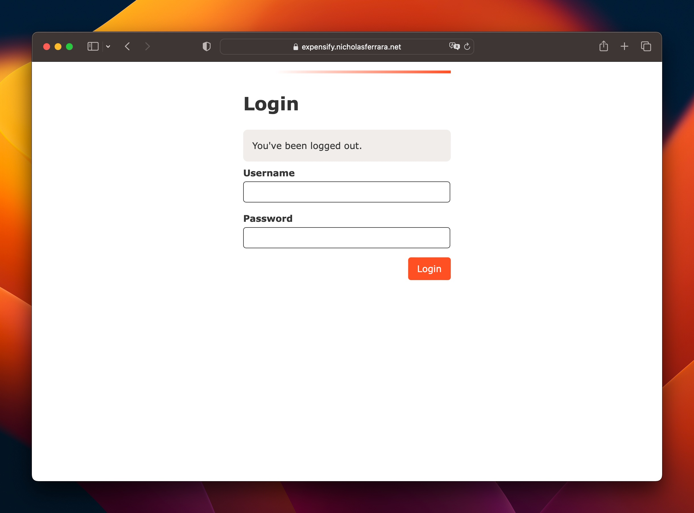
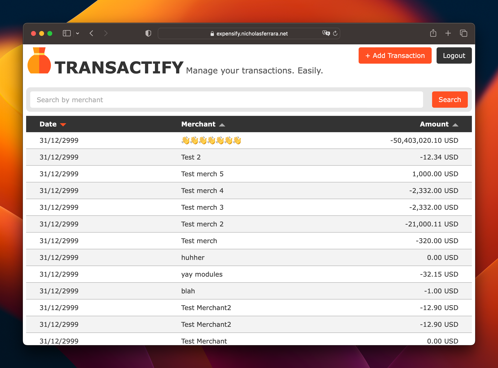
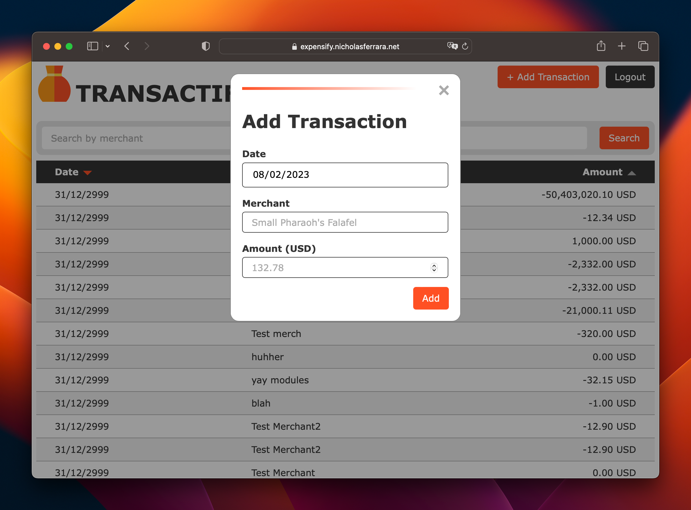

# Transactify PHP and JavaScript Demo Application

A demo web app without frameworks allowing users to login, create, and search
transactions which are fetched from an external API. To run locally run `make run` and
navigate to `localhost:8080`. If you do not have access to the Expensify API you can run
against sample data by running `make run-sample`. To use the real API you will need to
set the `partnerName` and `partnerPassword` in `config.php`.

Some shortcuts were taken to make this demo as simple as possible. For example, the
login cookie is not secured and code is not transpiled.

## Screenshots

The login page

The home page

The add a transaction page
